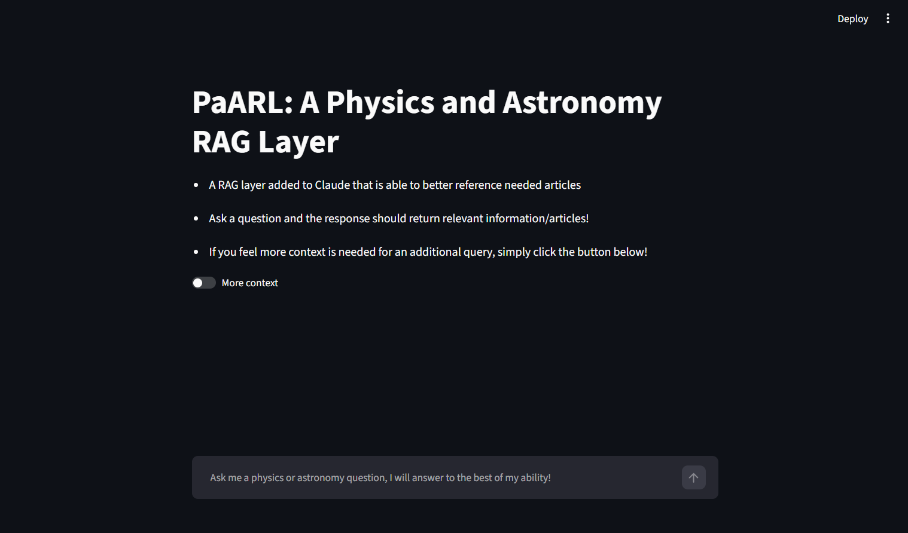
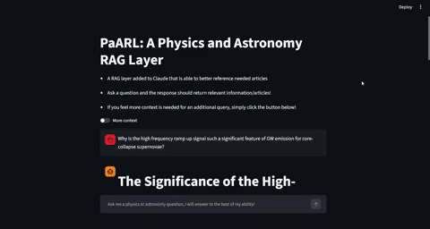

# PHYSICS AND ASTRONOMY RAG LAYER

This is a Physics and Astronomy RAG Layer (PaARL), custom built to accurately parse, retrieve and synthesize dense physics and astronomy literature using a fine-tuned reranker, specialized chunking algorithms, and HyDE retrieval. Provides accurate sources, sections and equations when referencing relevant media. It is compatible with all LLMs, though was designed with Anthropics Claude in mind.

 Provides in depth analysis and discussion of topics related to and including: 
 - Stellar remnants, 
 - Exoplanets, 
 - Supernovae, 
 - Bayesian Statistics, 
 - Bayesian Error, 
 - Globular Cluster, 
 - Electromagnetic Fields, 
 - Particle Scattering, 
 - Superconductors

As this project served as a method to better understand the process behind LLM information recall and its known limitations, a specialized chunking algorithm was constructed in lieu of Langchain.

A specialized reranker was fine tuned and evaluated using 50 questions designed to test the information ranking of the model.

 This README is organized as follows:

## Content
1. [Installation/Setup](#installation/setup)
    * [Prerequisites](#prerequisites)
2. [Chunking Algorithm](#getting-started)
3. [Rerankers used](#prerequisites)
    * [Evaluation metrics](#evaluation-metrics)
4. [Usage](#usage)
5. [Troubleshooting](#troubleshooting)
6. [Planned Improvements](#planned-improvements)
7. [Acknowledgements](#acknowledgments)
8. [License](#license)

## Installation/Setup

NOTE: this project was conducted in a WSL virtual environment; some commands/setup steps may differ for different environments.
Additionally, it is recommended to reconfigure WSL memory to include at least 7 GB (though at least 10 is ideal)

The paper corpus and vector database are not included, as arXiv's default license doesn't grant redistribution rights for most papers — build your own corpus per the instructions below.

### Prerequisites
The requirements for running this program in its current claude dependance is as follows:
- A claude developers account, including an API key that is currently active (at the start of each session, input `export ANTHROPIC_API_KEY= [YOUR_KEY_HERE]`)
- Anthropics Client installed with the command
`pip install Anthropic`
- A collection of data to be used as context, parsed in individual .mmd files
    - The pipeline has been trained/evaluated in accordance with about 1600 scientific papers in the genres listed above, any data used outside of this corpus has been unevaluated.
    - The chunking file is currently designed to accurately chunk META's NOUGAT parsed files, which uses standard .mmd notation, where headers/titles are signified by the "#" symbol. Files not adhering to this might run into citation issues from the LLM.
    -Additionally, the following python modules must be installed:

        - `streamlit`: 'pip install streamlit'
        - `ollama`: 'pip install ollama'
         -additionally, the phi:3 and Llama-3.2-1B-Instruct-GGUF are utilized.
         - phi:3 is obtainable through the command `ollama pull phi:3`
         - llama-3.2 is obtainable through `ollama pull hf.co/bartowski/Llama-3.2-1B-Instruct-GGUF`
        - `transformers/sentence_transformers`: `pip install huggingface`
        - `datasets`: `pip install datasets`
        - `torch.utils.data`: `pip install torch`

This pipeline was created with the following computer specs:
- AMD Ryzen 7 5800H with Radeon Graphics
- 16.0 GB DDR4 RAM
- NVIDIA GeForce RTX 3060 GPU (6 GB memory)

Although it is recommended to have at least 16 GB DDR5 and a NVIDIA 50 series GPU with more than 8 GB VRAM for manageable processing times. 
It is recommended to have files parsed using META's NOUGAT document parser, which for the 1600 papers ran for about 72 hours with the hardware mentioned above. Updated hardware will have drastically reduced times. 
The chunking algorithm (which includes vector embedding) took about 4 hours, and training loops took a similar time. Treat the above specs as an absolute minimum requirement, with significantly improved performance with better hardware. 

Additionally, the RAG itself takes about 30 seconds to a minute on this hardware, and is estimated to be 1-5 seconds with updated hardware, including time required to call the LLM.

Later versions of this pipeline will aim to be as locally ran as possible, and as such the minimum requirements may increase as better performing models are utilized. 

### Configuring the program

Install from repository:

`git clone https://github.com/GarforthAdam/PaARL`
`cd PaARL`

Reranker models also must be installed from the hugging face hub:

`pip install -U huggingface_hub`
`hf download AGarforth/astro-rag-reranker --local-dir Reranker_models/V3_clean`

Past versions (V1_clean/V2_clean) can be installed by replacing "V3" in the local directory with the respective model name.

## Chunking Algorithm

The chunking algorithm, in being produced for this project specifically, has a few notable features:
- Noting title, authors, subsection names, and parent section for each chunk, off of #'s. 
- As #'s proved to be unreliable for article title and authors, a low powered Ollama LLM is utilized to sort the text into the associated categories.
- Chunking by section wherever possible, though primarily measures token size and cuts off at the tokens embedding limit. 
- Two distinct checks to manage the irregular equations/tables of dense academic articles:
    - A function that checks for equation and table signifiers in markdown ("\begin{tabular}" and "\[, \]"), and should a chunk end before the section is completed, use allotted space between the cutoff tokens and max tokens amount to extend the chunk until the maximum tokens allowed is reached.
    - Additionally, chunks that end before tables are equations are completed are linked to subsequent chunks until the table or equation is completed, saving a separate database of "linked chunks," where if one is passed to the LLM during recall, all the linked chunks are passed for full context. I found that this never overloaded the LLM with too much context when present, and the LLM was able to use the extra context to its advantage.

The chunking algorithm itself can be run with:

`python chunking.py`

## Rerankers Used
The HuggingFace model "ms-marco-MiniLM-L-6-v2" was finetuned to better rank a physics/astronomy corpus. As such, three training loops were ran using the sentence_transformers architecture. A custom reranking training algorithm was not created as constructing a full RAG pipeline was prioritized, and it was estimated that the time commitment for an algorithm such as that would constitute an entirely new project. 

To create the training set, the abstracts of every paper that includes one is passed through a Claude model to create 5 academic questions that can be answered by only that article. Hard positive and soft negative lists are created through heuristics relative to the base similarity score of chunks and whether the chunk originates from the article itself. Questions have similarity scores produced for each chunk, where the top 20 are saved into sets depending on general heuristics.

Chunks with a high sim score but from a different article (higher than 0.80 sim score), or chunks with a low sim score (less than 0.80 sim score) from the same article are saved to an ambiguous list, that is then saved for manual review. A triplet setup is utilized of [(question), (positive chunk), (negative chunk)], where positive chunks are given a value of 1.0 and negatives 0.0. No variation of these weights is used in this pipeline as it was deemed unnecessary for these purposes.

The question sets are shuffled and 130 (%10 of papers with abstracts) questions are taken to test the model. The rest are used to train the model. 47 questions in the testing set and 43 in the training set have the top twenty ambiguous chunks manually reviewed to sort into the positive or negative sections. While this could be attributed to noise in the training set, it's best use was giving a sense as to how specific semantics in different article genres led to varying sim scores. Thus, for V3, new sim boundaries are introduced for different article genres (a low powered LLM sorts them by genre, as this was not saved during article parsing). 

### Evaluation Metrics

Rerankers were initially evaluated using traditional NDCG@10, MRR@10 and MAP@10 scores, shown below for each model. Note V1 was a model where training data was not changed, only testing data. V2 used only manual review in both training and testing data, and V3 used the new boundary metrics.

| Reranker Model | V1 | V2 | V3 |
| --- | --- | --- | --- |
| NDCG@10 | 0.8765 | 0.8722 | 0.7109 |
| MRR@10 | 0.9385 | 0.9196 | 0.7957 |
| MAP@10 | 0.8499 | 0.8506 | 0.6641 |

While these results fared poorly for the V3 model, and as V2 showed no significant difference compared to the initial evaluation, I feared that these evaluations were not representing the models accurately. As such, a small ablation study was conducted where blind responses would be constructed for a RAG result with no reranker, model V1, and model V3. 50 questions of varying difficulty were asked, and responses were graded out of 100 for correct information, the correct title/section referenced, no information hallucinated/improperly sourced, and the overall response quality. The average score for all models is shown below:

| No Reranker | V1 | V3 |
| --- | --- | --- |
| 87.82 | 87.76 | 87.7 |

While there was little variation in these results, it was noted that no reranker grabbed the widest breadth of information, while V3 was by far the most precise and in detail for the information it did grab. It was noted that the rerankers for focusing on very specific parts of the query, and thus, an additional ablation study was done using a reciprocal rank fusion (RRF) method, hoping to combine the best attributes of no model and the V3 model. This method was tested with the same questions for no reranker and RRF, and the following scores were found:

| No Reranker | RRF |
| --- | --- |
| 86.28 | 89.04 |

A significant increase in overall response accuracy and response quality was noted for the RRF method, and thus was used for the final product. 

The full evaluation spreadsheet for the ablation study can be found at:
https://docs.google.com/spreadsheets/d/1-7q0bRiukk4PMwLkeDSAwT64e0okKBpGf0XaTMUGOXU/edit?usp=sharing

The full evaluations of V1, V2, and V3 are included in the rrnkr_analysis directory, as well as the blind response and answer key files for each question.

BUG FIX: A data structuring bug was discovered in the V3 training pipeline where negative samples were not passed properly to the reranker. The V3 model was retrained with the corrected data and evaluated on the same test set as V1 and V2:

| Reranker Model | V3_FIX |
| --- | --- |
| NDCG@10 | 0.8218 |
| MRR@10 | 0.9039 |
| MAP@10 | 0.8499 |

Further analysis will have to be done to understand why the RRF scored so well in this case. A quick spearman correlation and measurement of the std for a test set revealed that the bugged V3 found materially different chunks compared to the base similarity score; this inadvertently gave a higher spread of chunks to the LLM. It is hypothesized then that the LLM was able to accurately make connections using this wider range of information, producing factually correct information. This reranker has not yet been run through the blind grading procedure, but can be passed through the program using:

`hf download AGarforth/astro-rag-reranker --local-dir Reranker_models/V3_clean_FIX`

This includes the full positives and negatives from the field-specific bounds, as well as higher weights for named objects (ex. M15 vs. M71)

## Usage

## WARNING: 
This pipeline was primarily created for my own use, not as a product for the general public. As such, there may be a few points where, should one want to use this for themselves, they will have to go through the code and change a few lines to fit their own computer. When this is necessary I will do my best to point a user to the location in the files where these changes are needed. 

In `chunking.py`, line 253/257, ensure your directories are correctly pointing to a folder including your parsed pdfs.

In `definitions.py`, ensure your files are readily available and pointed in the correct directory.

Search the code for [path_to] and replace it with your own absolute paths. Also search for [path_to_parsed_files].

`Abstracts.py`, `model_test.py`, `RAG_model_test.py` and `Reranker.py` are not needed for the programs function, but are included in `\program_eval` to give insight as to how the various steps of the RAG were evaluated.

Run the programs in the following order: `chunking.py` -> `RAG.py` -> `RAG_v1.py`

As this RAG utilizes streamlit, use the command

`streamlit run RAG_v1.py`

to open a chat with the LLM.

Ask a physics or astronomy based query to get an accurate response. Note HyDE decomposition is used for better semantic comparison in cosine similarity, to two Claude API calls occur in 1 query. 

Then a response will be generated using the provided context, with an addendum at the end where the model uses the context to add additional information from its training data. Whenever information is provided that is not sourced from the context, the model explicitly states so. This is a feature added for my own benefit, and its advantages have not been tested in depth.

Use the `More Context` button to have the pipeline retrieve additional context should you ask a follow-up question that would not be covered by the knowledge the AI recalled. NOTE THE PIPELINE DOES NOT CHECK FOR THIS AUTOMATICALLY. It is on the users own volition whether or not to add additional context.

## Troubleshooting

The only known error would come from poor chunking due to poor parsing - most likely an occurrence from the parser not using #'s to denote new sections. Some articles are also formatted such that the title and authors appear past the abstract, which can also cause parsing issues. These are only improved by unfortunately rerunning the document parsing on saved pdfs.

Occasionally the LLM may reference [MISSING_PAGE_FAIL:N] or potential AUTHOR - which are also parsing errors, and can be resolved by rerunning the document parser. 

The LLM may ignore the formatting output requested in some of the chunking steps - if this occurs rerun the chunking program and it should produce a desirable output. 

Persistent errors or issues in information recall should be sent to the project owner to fix in subsequent versions.

## Planned Improvements

As this project was used to give me more insight to AI use and get more familiar with the machine learning landscape, more advanced features were moved to later versions when I have better hardware and an overall better grasp at the scale of the project. The considered improvements are included below:

- (personal) Generating parsed documents using various parsers that excel in different fields (MiNerU for general text, NOUGAT for equations/tables)
- Summarizing equation meaning in each text such that the descriptions are better picked up by the cosine similarity, and using the linked chunks feature so the actual equation is passed to the LLM. (do similarly for tables)
- Using query decomposition to generate individual results for multiple-part questions
- Testing a late chunking method, involving adding a blurb to each chunk before embedding for better context
    - This method is also complemented by having an LLM explicitly highlight the title/authors/sections as the entire article is passed through it, allowing for more accurate labelling
- Testing a Graph RAG (involving restructuring the chunking algorithm) to determine if its more effective for this role
- Make the layer more user friendly with a setup doc to prompt for files, and tie the .pkl files to relative location

## Acknowledgments
I'd like to acknowledge that claude code was used to assist the development of the pipeline, to confirm that I was on the right track through development and assisting in coding at points. 

Additionally, claude api is utilized in this project for developing abstract questions, HyDE and the final response. 

Ollama api is utilized for decoding title/authors of articles, and sorting article titles into genres.

I would also like to acknowledge the laptop this project was built with, an HP OMEN 15, as to be completely honest I thought I would be stopped multiple times by hardware limitations, but was able to push through using just these specs. Also the laptop did not overheat and burnout any components, allowing me to finish the program without buying a new computer.

## License

All parts of this project fall under the Apache 2.0 license agreement. Should any distinct method used here be used or modified, a reference or credit is not required, but would be appreciated. 

For contact/additional inquiries, please contact
adamgarforth0@gmail.com
